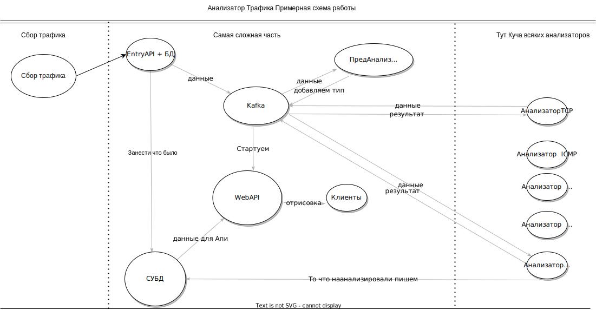

# TAAS
## Traffic And Analyzer Storage
Проект является ответвлением проекта YATA, так как в определённый момент иследований ко мне пришла новая концепция о подходе к укращению работы с трафиком.

### History 
Я и мой друг из команды SiBears начали вести разработку YATA (yet another traffic analysis), но в процессе разрабоки что-то пошло не так и моя концепция немного изменилась.
#### Изначальный концепт 

Но в процессе моего исследования мобильных приложений и не хороших утилит - стало понятно что данную концепцию нужно вынести за рамки обычного CTF.

### Структура проекта сейчас 
Сейчас проект находится в стадии активного иследования и реализации требований к конечному продукту , но уже сейчас появилось достаточно много различных скриптов и дополнений.  
1) Утилите точно необходима функция прокси как в burp + ssl
2) Необходимо отдельное хранилище всего трафика
3) Автоматическая генерация эксплоитов на основе трафика  